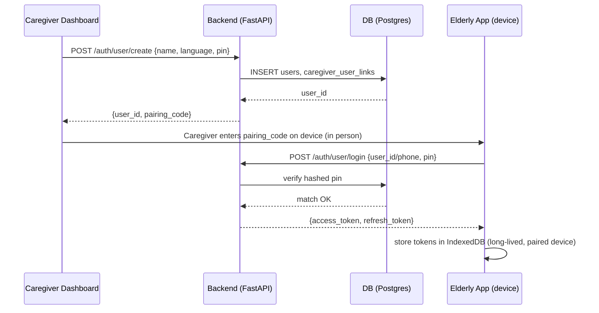
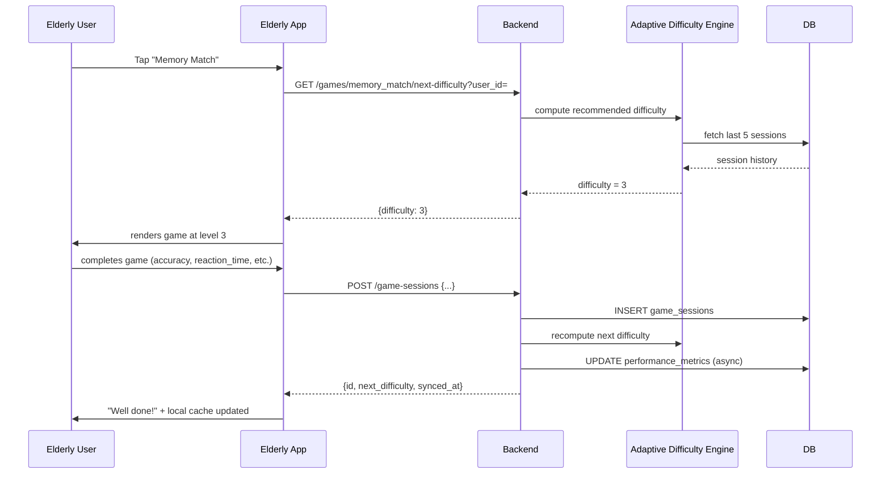
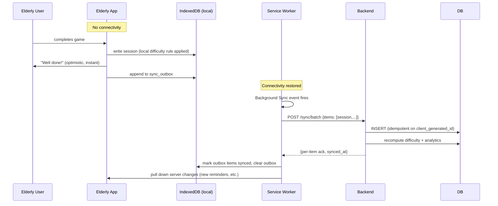
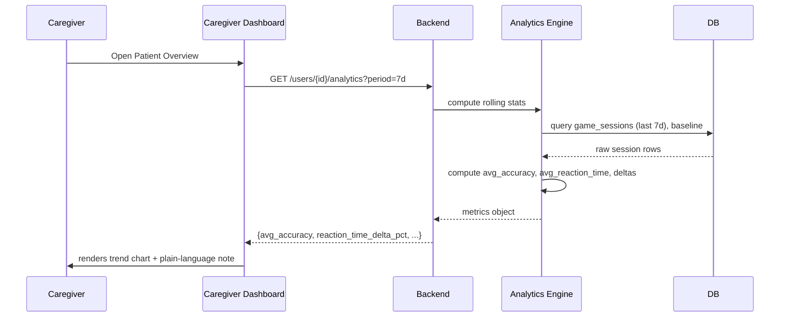
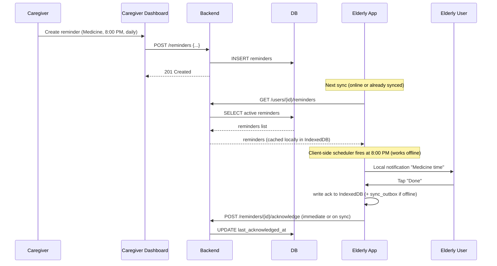
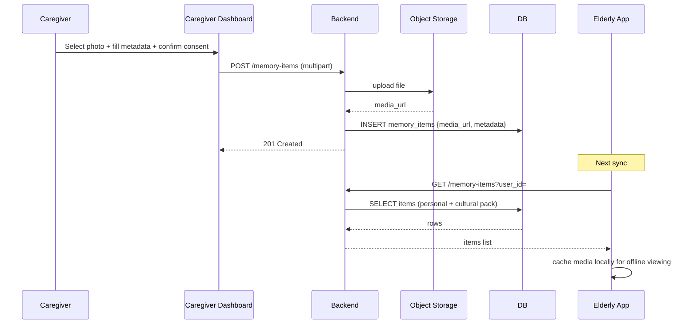
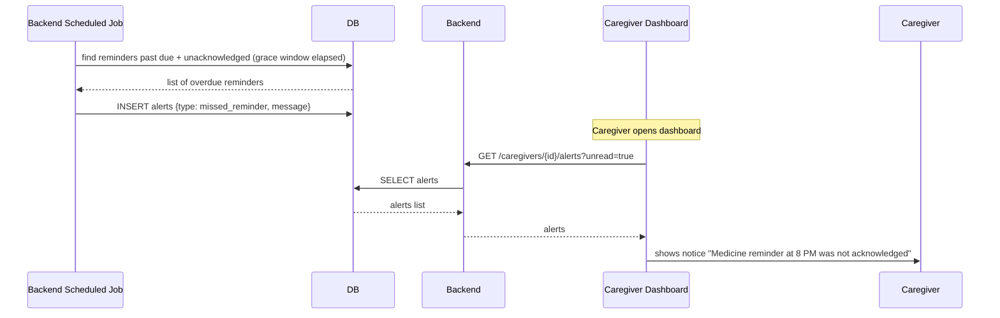

# 13 — Sequence Diagrams

All diagrams in Mermaid syntax — render directly on GitHub, or paste into mermaid.live for a visual.

## 1. Elderly User Login (Device Pairing)

## 2. Play a Game — Online

## 3. Play a Game — Offline, Then Sync

## 4. Caregiver Views Analytics

## 5. Reminder Creation → Delivery → Acknowledgment

## 6. Caregiver Uploads a Reminiscence Photo

## 7. Missed Reminder → Caregiver Alert

